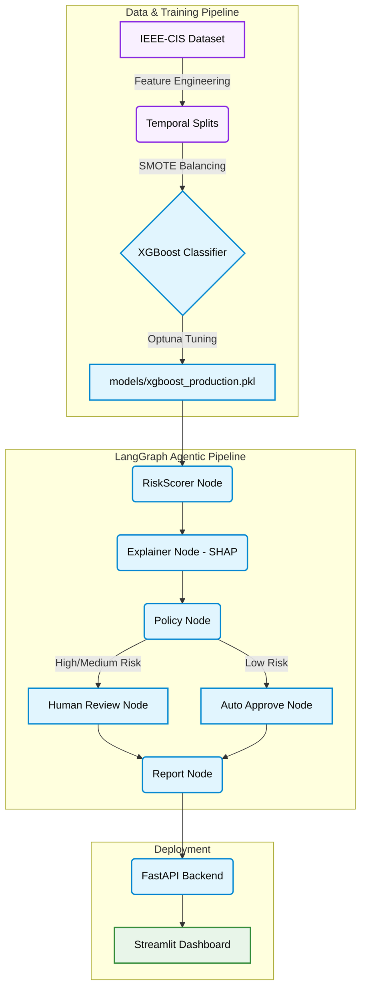

<div align="center">

# Agentic-Fraud-Sentinel

**A production-grade, multi-agent fraud detection system using XGBoost with SHAP explainability, Optuna hyperparameter tuning, SMOTE class balancing, LangGraph agentic orchestration, and a real-time FastAPI backend.**

[](https://www.python.org/)
[](https://xgboost.readthedocs.io/)
[](https://fastapi.tiangolo.com/)
[](https://streamlit.io/)

</div>

---

## Architecture Overview



The platform processes the standard **IEEE-CIS Dataset** (590k transactions) through a multi-stage pipeline.

---

## Features

| Component | Description |
|---|---|
| **Data & Feature Engineering** | Performs time-based splitting (by `TransactionDT`) to simulate real-world data drift. Implements rolling aggregates, frequency encoding, missingness flags, and SMOTE to balance class representation (3.5% to 10% fraud). |
| **XGBoost ML Core** | Trains an XGBoost classifier tuned via Optuna (50-trial Bayesian search with StratifiedKFold cross-validation) and calibrated using precision-recall curve analysis for optimal operational decision boundaries. |
| **SHAP Interpretability** | Uses SHAP TreeExplainer to generate per-prediction feature attribution values, providing model transparency with exact Shapley value computation for tree-based models. |
| **LangGraph Agentic Pipeline** | Orchestrates a 5-node stateful agent graph: RiskScorer → Explainer → Policy → [HumanReview \| AutoApprove] → Report, with conditional routing based on risk tiers. |
| **Deployment Services** | Fully containerized environment featuring a FastAPI backend (`/predict`, `/health`, `/metrics`) and a real-time Streamlit monitoring dashboard. |

---

## Model Performance Metrics

| Optimization Stage | AUC-ROC | AUC-PR | Precision | Recall | F1 Score |
|:---|:---:|:---:|:---:|:---:|:---:|
| **XGBoost Baseline** | 0.9012 | 0.5246 | 0.8007 | 0.3253 | 0.4626 |
| **Optuna Tuned** | 0.9070 | 0.5758 | 0.8335 | 0.3942 | 0.5352 |
| **Optimal Threshold** (0.216) | 0.9070 | 0.5758 | 0.6990 | 0.4845 | 0.5723 |

**Key Exploratory Data Analysis (EDA) Insights:**
- Fraud rate is strictly non-stationary, ranging from 2%–4.8% over a 185-day window.
- Handled 214 high-cardinality features with >50% missing values via strict missingness flags.
- `TransactionAmt` alone is an extremely weak signal; 4 out of 6 engineered behavioral features dominate the SHAP importance rankings.

---

## Technology Stack

| Component | Technologies |
|:---|:---|
| **Data Processing** | `pandas`, `numpy`, `scikit-learn` |
| **Imbalanced Learning** | `imbalanced-learn` (SMOTE) |
| **Machine Learning** | `XGBoost`, `LightGBM` |
| **Hyperparameter Tuning** | `Optuna`, `StratifiedKFold Cross-Validation` |
| **Interpretability** | `SHAP` (TreeExplainer) |
| **Agentic Orchestration** | `LangGraph` |
| **API & Serving** | `FastAPI`, `uvicorn` |
| **Frontend & Visualization** | `Streamlit`, `Matplotlib`, `Plotly` |
| **Containerization** | `Docker` |

---

## Project Structure

```text
Agentic-Fraud-Sentinel/
├── data/
│   ├── raw/                  # IEEE-CIS source CSVs
│   └── processed/            # Engineered, split, balanced data
├── notebooks/
│   ├── eda.ipynb             # Exploratory Data Analysis
│   ├── preprocessing.ipynb   # Feature engineering pipelines
│   ├── model.ipynb           # XGBoost training & Optuna tuning
│   ├── shap.ipynb            # SHAP explainability analysis
│   ├── graph.ipynb           # LangGraph pipeline testing
│   └── api.ipynb             # API endpoint testing
├── src/
│   ├── data/                 # Data pipelines (preprocessing, features)
│   ├── models/               # XGBoost training & evaluation scripts
│   ├── explainibility/       # SHAP TreeExplainer integration
│   └── agents/               # LangGraph nodes, state, and graph definition
├── api/
│   └── main.py               # FastAPI application
├── dashboard/
│   └── app.py                # Streamlit monitoring UI
├── Dockerfile                # Container configuration
└── requirements.txt          # Python dependencies
```

---

## Setup & Execution

### 1. Environment Initialization
```bash
git clone https://github.com/aryan11singh/Agentic-Fraud-Sentinel.git
cd Agentic-Fraud-Sentinel
python -m venv venv
source venv/bin/activate      # Linux/Mac
venv\Scripts\activate         # Windows
pip install -r requirements.txt
```

### 2. Dataset Ingestion
Download the IEEE-CIS Fraud Detection dataset from [Kaggle](https://www.kaggle.com/c/ieee-fraud-detection). Place the raw files in the `data/raw/` directory:
- `data/raw/train_transaction.csv`
- `data/raw/train_identity.csv`

### 3. Deployment
- **API URL:** https://agentic-fraud-sentinel.onrender.com/docs